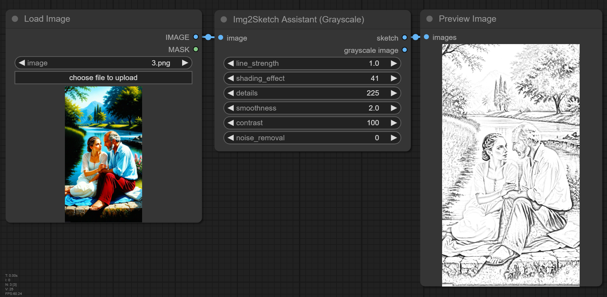
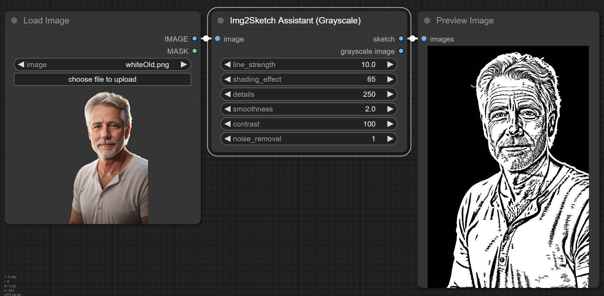
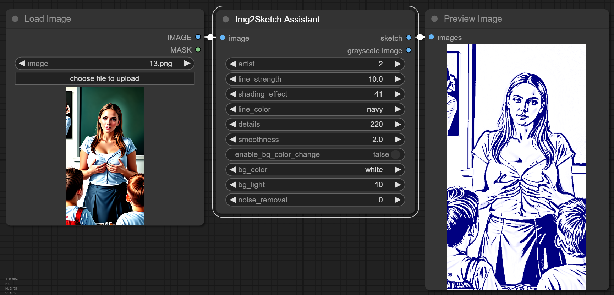
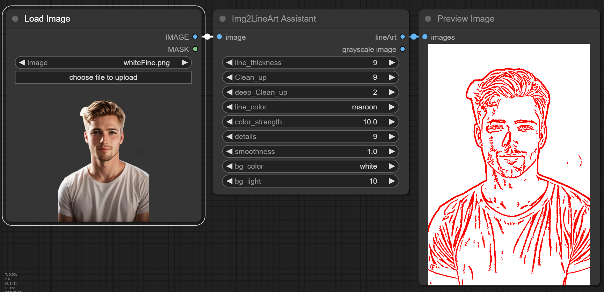
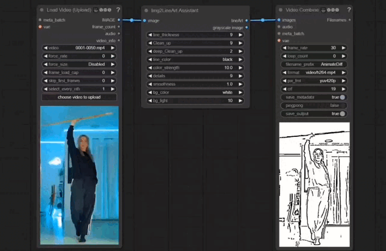
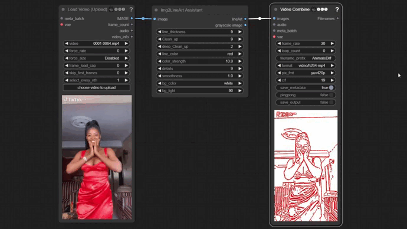

## ComfyUI-Img2DrawingAssistants
These are 4 ComfyUI custom nodes to assist in converting an image to sketches or lineArts (both grayscale and colored lines).

## Img2Sketch Assistant (Grayscale)

The Img2Sketch Assistant (Grayscale) node converts images to sketches.

<div align="center">

 <br></br>

</div>

## Img2Sketch Assistant

The Img2Sketch Assistant node converts images to both grayscale and colored sketches.

<div align="center">

 <br></br>
</div>

## Img2LineArt Assistant

The Img2LineArt Assistant node converts images to colored lineArts.

<div align="center">

 <br></br>
</div>

## LineArt2LineArt Assistant

The LineArt2LineArt Assistant node can be used to modify both sketches and lineArts.

<div align="center">

 <br></br>
</div>

## Video to LineArt Animation

The nodes can also be used to convert videos to Animation.

<div align="center">

 <br></br>

</div>

## Workflow with all four Nodes

A Workflow (Img2DrawingAssistantsWorkflow.json) with all four Nodes can be found in the /Img2SketchImages/ folder.

<div align="center">

 <br></br>
</div>

**<font color=red> Note </font>**:

- >These nodes are to assist you in converting images to sketches or lineArts. The quality of the output depends on the quality of the input. You may need to make modifications to the output sketches or lineArts.

- >You can also connect a lineArt preprocessor to the LineArt2LineArt Assistant node and modify as you please.

- >You can install these nodes with the ComfyUI Manager. Search by entering:


     ```
     ComfyUI-Img2DrawingAssistants

     ```

I will release a video on using these nodes soon.

## Disclaimer
 
I am not responsible for any user-generated content. Users are fully responsible for their actions when using these nodes. I don't have any legal affiliation with or accountability for users' behaviors. It is crucial to use these nodes responsibly, following both ethical and legal standards.


